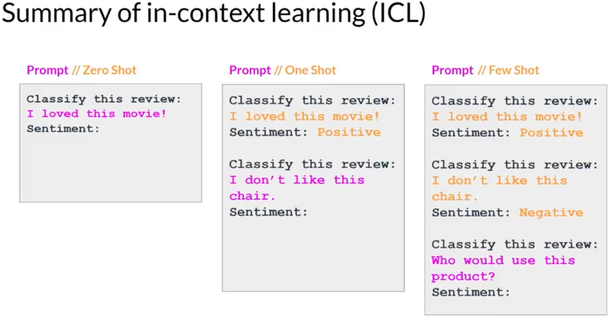

# Large Language Models

\

# Prompts and completions

\

# Transformers

- Self-attention
- Encoder
- Decoder
- Tokenizer: converts the words into numbers
  - token(each): a verctor and occupies

## Transformers architecture

- Working architecture

### Encoder:

- inputs ("prompts") with contextual understanding and produces one verctore per unput token.

### Decoder:

- Accepts input token and generates new tokens

### Models:

- Encoder Only: sentimental analysis, BART
- Encoder Decoder: BERT, T5,

### Decoder Only Models:

- GPTs, BLOOM, Jurassic, LLaMA

#

# In-context Learning (ICL)

- Zero Shot inference
- One Shot inference
- Few Show inference

# Generative config

- Max new tokens
- Sample top K
- Sample top P
- Temperature

## Temperature 調整概率

> Following content was generated by Grok3

## Generative Configuration 的數學公式

在生成式模型中，**Temperature**、**Sample top K** 和 **Sample top P** 是三個重要的參數，用來控制模型生成文本時的隨機性和多樣性。以下是它們的精確數學描述。

### 1. Temperature 調整概率

**Temperature（溫度）參數 $ T $** 用來調整模型生成下一個詞時的概率分佈，控制其隨機性。

- **原始概率**：假設詞彙表中的每個詞 $ w $ 有一個原始概率 $ p(w) $，表示模型預測該詞的初始可能性。
- **調整後的概率**：經過 Temperature 調整後，詞 $ w $ 的新概率 $ p'(w) $ 為：

$$p'(w) = \frac{\exp\left(\frac{\log(p(w))}{T}\right)}{\sum_{w'} \exp\left(\frac{\log(p(w'))}{T}\right)}$$

- 這裡，$ T $ 是 Temperature 參數。
- $ \log(p(w)) $ 是原始概率的對數（即 logits），通過 $ T $ 進行縮放後，再由 softmax 函數轉換回概率分佈。

#### Temperature 的影響

- **當 $ T = 1 $**：$ p'(w) = p(w) $，概率分佈保持不變。
- **當 $ T < 1 $**：概率分佈變得更尖銳，高概率的詞被進一步放大，低概率的詞被壓制，生成結果更確定。
- **當 $ T > 1 $**：概率分佈變得更平滑，各詞的概率差距縮小，生成結果更隨機。

---

### 2. Sample top K 的概率

**Sample top K** 是一種採樣方法，限制模型只從概率最高的前 $ K $ 個詞中選擇。

- **篩選詞集**：在調整後的概率分佈 $ p'(w) $ 中，選出概率最高的前 $ K $ 個詞，組成詞集 $ \mathcal{W}\_K $。
- **最終選擇概率**：模型從 $ \mathcal{W}\_K $ 中均勻隨機選擇一個詞，每個詞 $ w $ 被選中的概率為：

$$
P(w) =
\begin{cases}
\frac{1}{K} & \text{if } w \in \mathcal{W}\_K \\
0 & \text{otherwise}
\end{cases}
$$

- $ K $ 是詞集 $ \mathcal{W}\_K $ 的大小，詞集外的詞概率為 0。

#### 作用

Sample top K 通過限制選擇範圍，避免選到過低概率的詞，同時保持一定的多樣性。

---

### 3. Sample top P 的概率

**Sample top P**（也稱為 Nucleus Sampling）根據累積概率動態選擇詞集。

- **篩選詞集**：選出最小的詞集 $ \mathcal{W}\_P $，使得這些詞的調整後概率總和滿足：

$$
\sum\_{w \in \mathcal{W}\_P} p'(w) \geq P
$$

- $P$ 是指定的累積概率閾值，$\mathcal{W}\_P$ 是滿足該條件的最小詞集。
- **最終選擇概率**：模型從 $\mathcal{W}\_P$ 中均勻隨機選擇一個詞，每個詞 $w$ 被選中的概率為：

$$
P(w) =
\begin{cases}
\frac{1}{|\mathcal{W}\_P|} & \text{if } w \in \mathcal{W}\_P \\
0 & \text{otherwise}
\end{cases}
$$

- $|\mathcal{W}\_P|$ 是詞集 $\mathcal{W}\_P$ 中的詞數。

#### 作用

Sample top P 根據上下文動態調整詞集大小，比 top K 更靈活，能更好地平衡生成文本的多樣性和質量。

---

### 總結

- **Temperature**：通過 $T$ 調整概率分佈的尖銳程度，$T < 1$ 強調高概率詞，$T > 1$ 增加隨機性。
- **Sample top K**：從前 $K$ 個高概率詞中均勻選擇，固定詞集大小。
- **Sample top P**：從累積概率達 $P$ 的最小詞集中均勻選擇，詞集大小動態變化。

#

> This content was generate by Grok3
